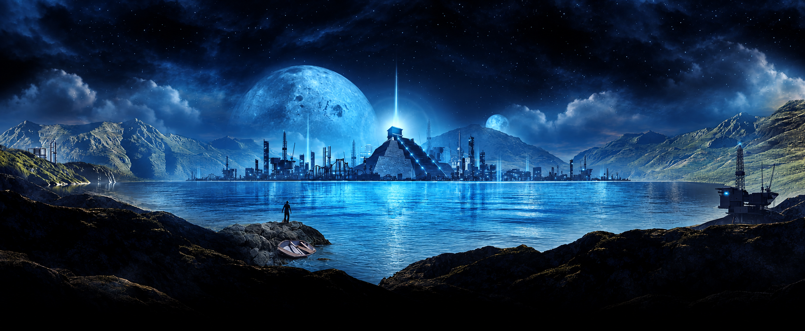

# Attractor



V5 Attractor inspired me, and many others, to enter web design and development. This is a grateful independent homage to that work and a small hope to revive expressive, atmospheric web design.

[View the hosted experience](https://www.neilopet.me/2advanced-attractor-homage/)

Move through six atmospheres with a slow opening, hover previews, keyboard navigation, and music that stays continuous as the shutters change.

## Experience

- Six scenic worlds with original source panoramas and AI-assisted remaster interpretations.
- A staged loading and splash sequence with a central light, then a full-screen shutter arrival.
- Individual interface elements arrive over about 4.6 seconds after the first world appears.
- Synchronized shutters, separate interface cues, and one continuously looping music buffer.
- A hover or keyboard preview for the featured project, with a 24-second silent scenic film.
- Keyboard navigation, focus states, replay, mute, and reduced-motion support.

The remasters are lossless interpretations of the source scenes at their returned dimensions. They are not recovered 4K artwork. Original panoramas remain alongside them in `public/scenes/`. The interface effects are reconstructed around original extracted sounds, and the new film is a silent scenic study rather than the historical demo reel.

## Run locally

Node 24 or newer is recommended. No API keys are needed.

```bash
git clone https://github.com/neilopet/2advanced-attractor-homage.git
cd 2advanced-attractor-homage
npm ci
npm run dev
```

Open the local URL printed by the dev server.

For a production build and local built preview:

```bash
npm run build
npm start
```

The independent GitHub Pages profile uses `build:static` and
`NEXT_PUBLIC_BASE_PATH`, which defaults to an empty value and can be set to the
repository base path for a project site. For the repository site, run:

```bash
NEXT_PUBLIC_BASE_PATH=/2advanced-attractor-homage npm run build:static
```

The static client is written to `dist/client` and should be mounted at the
configured prefix. Leave the variable empty for a root preview. Website
deployment remains separate from the source repository's licensing and media
rights.

## How it is built

This is a Vinext, React, and TypeScript application. Rive Canvas drives the editable shutter animation, while Web Audio keeps music and interaction cues independent. It is a small application with a component and library structure, rather than a static `index.html` folder.

## Repository map

- [`app/`](app/) — page, layout, styles, shutter and motion UI.
- [`lib/`](lib/) — journey sequencing, arrival timing, and soundscape behavior.
- [`public/`](public/) — versioned scenes, audio, Rive runtime/media, and the scenic film.
- [`assets/`](assets/) — editable Rive source and remaster notes/prompts.
- [`tests/`](tests/) — focused behavior tests for journeys, arrivals, and audio.
- [`docs/`](docs/) — reconstruction notes, evidence, and provenance.
- [`LICENSE`](LICENSE) and [`LICENSING.md`](LICENSING.md) — scoped project license and scope map.
- [`third_party/`](third_party/) and [`public/third-party-notices.txt`](public/third-party-notices.txt) — vendor notices for source and shipped runtime code.
- [`public/licensing.html`](public/licensing.html) — browser-facing licensing and attribution page.
- [`AGENTS.md`](AGENTS.md) — contribution, validation, asset, and release guidance.

## Credits and scope

This project adapts the layout and atmosphere of 2Advanced V5 Attractor as an independent homage. It does not claim affiliation with 2Advanced, ownership of the original artwork, audio, branding, or source files, or any license grant for them. See [asset credits and provenance](docs/ASSET-CREDITS.md) and the [experience reconstruction notes](docs/EXPERIENCE.md).

The scoped [MIT license](LICENSE) is intended for original project software,
tests, configuration, and documentation, to the extent Neil Opet and
contributors hold the relevant rights, as described in [`LICENSING.md`](LICENSING.md).
It does not license historical or source-derived artwork, audio, vector files,
branding, original Flash material, AI-assisted remaster pixels, the scenic
film, or third-party code.
See the [browser-facing licensing page](public/licensing.html) and the [full
asset credits](docs/ASSET-CREDITS.md) for the attribution and rights boundary.

Thank you to Eric Jordan, Tony Novak, and John Carroll for the founding vision; to Shane Mielke for documented animation, ActionScript, and production design on the 2006 release; and to the broader V5 artists, developers, and sound contributors.

Visit the [official restored V5 archive](https://v5attractor.2advanced.com/) and [Eric Jordan's V5 art portfolio](https://www.behance.net/gallery/19738001/2Advanced-V5-Website-Attractor-%282010%29) for the historical work.
